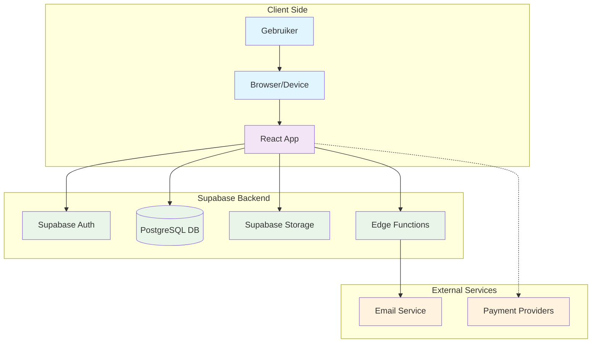
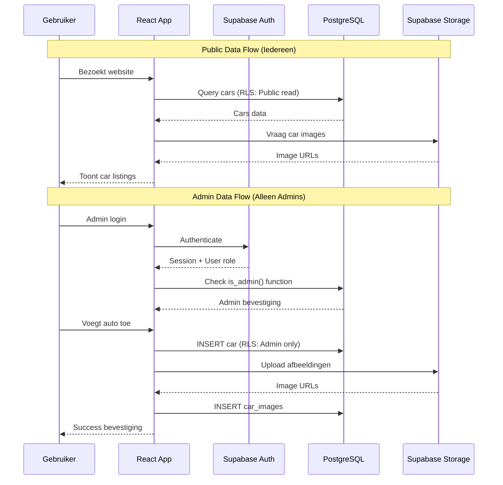
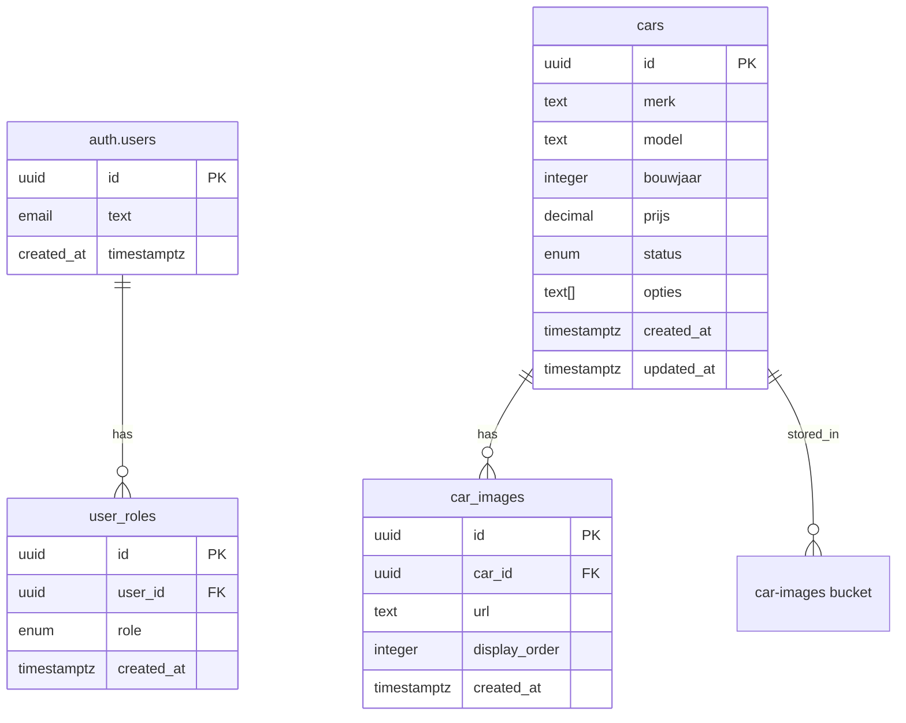
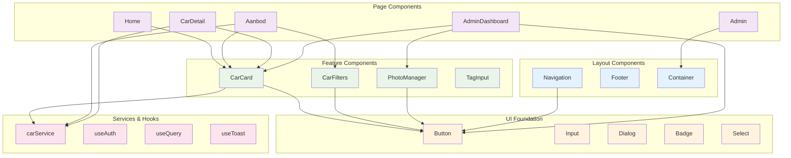
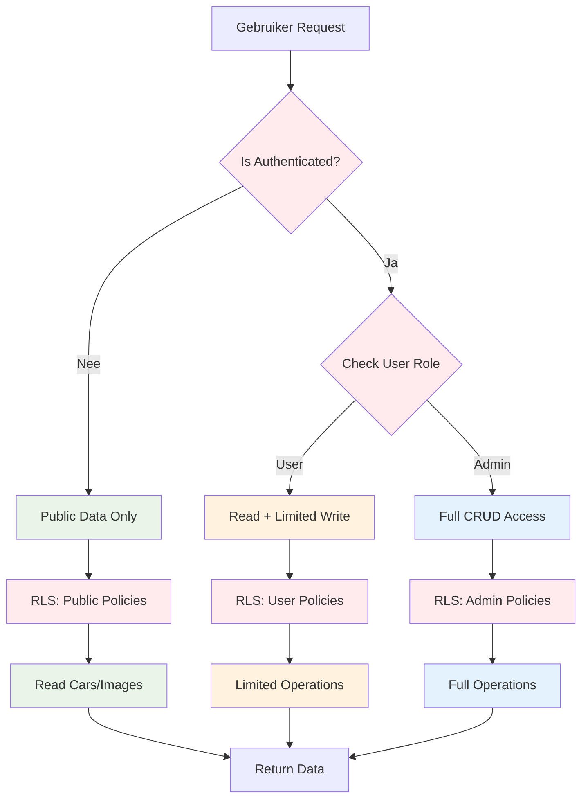
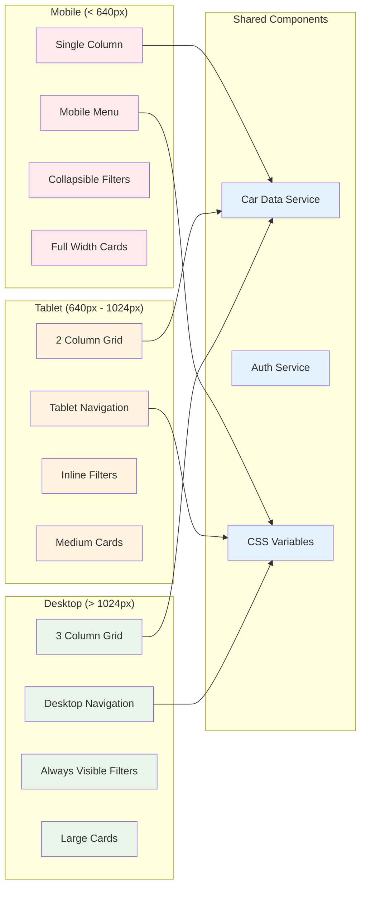
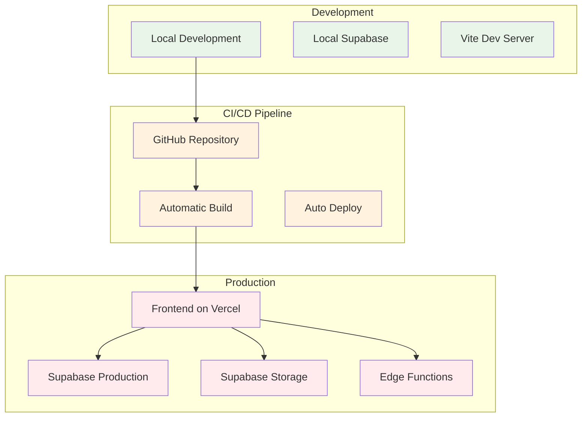
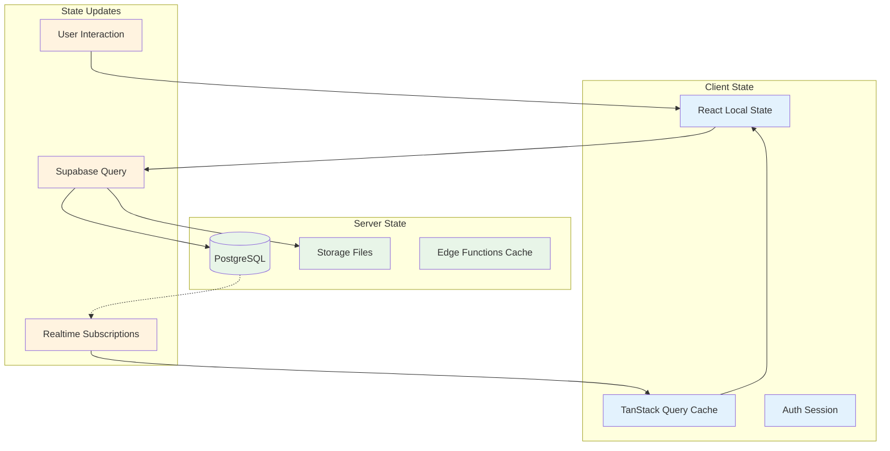

# Kraakman - System Architecture

## 🏗️ Hoog-Niveau Architectuur

## 🔄 Data Flow Architecture

## 🗄️ Database Relatie Schema

## 🎨 Component Architecture

## 🔐 Security Architecture Flow

## 📱 Responsive Architecture

## 🚀 Deployment Architecture

## 🔄 State Management Flow

---

Deze architectuur documentatie laat zien hoe het Kraakman platform is opgebouwd met moderne, schaalbare technologieën en best practices voor security en performance.