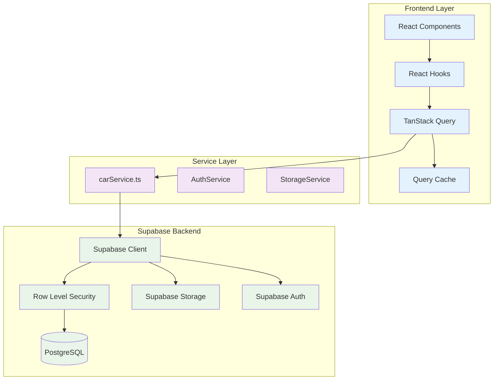

# Kraakman - Data Flow & API Patterns

## 🔄 Data Flow Architectuur

**Kraakman** implementeert een directe client-to-database architectuur via Supabase, met minimal overhead en maximale performance. Het systeem gebruikt TanStack Query voor intelligent caching en React state management voor UI updates.

## 📊 Data Flow Overzicht



## 🚀 Data Fetching Patterns

### TanStack Query Configuration

```typescript
// src/lib/queryClient.ts
import { QueryClient } from '@tanstack/react-query'

export const queryClient = new QueryClient({
  defaultOptions: {
    queries: {
      staleTime: 5 * 60 * 1000, // 5 minutes
      cacheTime: 10 * 60 * 1000, // 10 minutes
      retry: 3,
      retryDelay: attemptIndex => Math.min(1000 * 2 ** attemptIndex, 30000),
      refetchOnWindowFocus: false,
      refetchOnReconnect: true,
    },
    mutations: {
      retry: 1,
    },
  },
})
```

### Car Service Layer

```typescript
// src/services/carService.ts
import { supabase } from '@/integrations/supabase/client'

// Type definitions
export interface Car {
  id: string
  merk: string
  model: string
  bouwjaar: number
  kilometerstand?: number
  prijs: number
  status: 'aanbod' | 'verkocht'
  car_images?: CarImage[]
  opties?: string[]
  // ... other fields
}

export interface CarFilters {
  search?: string
  merk?: string
  minPrijs?: number
  maxPrijs?: number
  minBouwjaar?: number
  maxBouwjaar?: number
  brandstofType?: string
  transmissie?: string
  sortBy?: string
  sortOrder?: 'asc' | 'desc'
}

// Main car fetching function
export const getCars = async (filters: CarFilters = {}): Promise<Car[]> => {
  let query = supabase
    .from('cars')
    .select(`
      *,
      car_images (
        id,
        url,
        display_order
      )
    `)
    .eq('status', filters.status || 'aanbod')

  // Apply filters
  if (filters.search) {
    query = query.or(
      `merk.ilike.%${filters.search}%,model.ilike.%${filters.search}%,opties.cs.{${filters.search}}`
    )
  }

  if (filters.merk) {
    query = query.eq('merk', filters.merk)
  }

  if (filters.minPrijs) {
    query = query.gte('prijs', filters.minPrijs)
  }

  if (filters.maxPrijs) {
    query = query.lte('prijs', filters.maxPrijs)
  }

  if (filters.minBouwjaar) {
    query = query.gte('bouwjaar', filters.minBouwjaar)
  }

  if (filters.maxBouwjaar) {
    query = query.lte('bouwjaar', filters.maxBouwjaar)
  }

  if (filters.brandstofType) {
    query = query.eq('brandstof_type', filters.brandstofType)
  }

  if (filters.transmissie) {
    query = query.eq('transmissie', filters.transmissie)
  }

  // Apply sorting
  const sortBy = filters.sortBy || 'created_at'
  const sortOrder = filters.sortOrder || 'desc'
  query = query.order(sortBy, { ascending: sortOrder === 'asc' })

  const { data, error } = await query

  if (error) {
    console.error('Error fetching cars:', error)
    throw error
  }

  return data || []
}

// Get single car by ID
export const getCarById = async (id: string): Promise<Car | null> => {
  const { data, error } = await supabase
    .from('cars')
    .select(`
      *,
      car_images (
        id,
        url,
        display_order
      )
    `)
    .eq('id', id)
    .single()

  if (error) {
    console.error('Error fetching car:', error)
    throw error
  }

  return data
}

// Create new car
export const createCar = async (carData: Partial<Car>): Promise<Car> => {
  const { data, error } = await supabase
    .from('cars')
    .insert(carData)
    .select()
    .single()

  if (error) {
    console.error('Error creating car:', error)
    throw error
  }

  return data
}

// Update existing car
export const updateCar = async (id: string, carData: Partial<Car>): Promise<Car> => {
  const { data, error } = await supabase
    .from('cars')
    .update(carData)
    .eq('id', id)
    .select()
    .single()

  if (error) {
    console.error('Error updating car:', error)
    throw error
  }

  return data
}

// Delete car
export const deleteCar = async (id: string): Promise<void> => {
  const { error } = await supabase
    .from('cars')
    .delete()
    .eq('id', id)

  if (error) {
    console.error('Error deleting car:', error)
    throw error
  }
}
```

## 🎣 React Query Hooks

### Custom Hook voor Cars

```typescript
// src/hooks/useCars.ts
import { useQuery, useMutation, useQueryClient } from '@tanstack/react-query'
import { getCars, CarFilters, createCar, updateCar, deleteCar } from '@/services/carService'
import { toast } from '@/hooks/use-toast'

export const useCars = (filters: CarFilters = {}) => {
  return useQuery({
    queryKey: ['cars', filters],
    queryFn: () => getCars(filters),
    staleTime: 2 * 60 * 1000, // 2 minutes for car listings
  })
}

export const useCar = (id: string) => {
  return useQuery({
    queryKey: ['car', id],
    queryFn: () => getCarById(id),
    enabled: !!id,
    staleTime: 5 * 60 * 1000, // 5 minutes for individual cars
  })
}

export const useCreateCar = () => {
  const queryClient = useQueryClient()

  return useMutation({
    mutationFn: createCar,
    onSuccess: (newCar) => {
      toast({
        title: "Success",
        description: "Auto succesvol toegevoegd",
      })

      // Invalidate and refetch cars query
      queryClient.invalidateQueries({ queryKey: ['cars'] })

      // Optionally add to cache immediately
      queryClient.setQueryData(['car', newCar.id], newCar)
    },
    onError: (error) => {
      toast({
        title: "Fout",
        description: "Er is een fout opgetreden bij het toevoegen van de auto",
        variant: "destructive",
      })
      console.error('Create car error:', error)
    },
  })
}

export const useUpdateCar = () => {
  const queryClient = useQueryClient()

  return useMutation({
    mutationFn: ({ id, data }: { id: string; data: Partial<Car> }) =>
      updateCar(id, data),
    onMutate: async ({ id, data }) => {
      // Cancel ongoing queries
      await queryClient.cancelQueries({ queryKey: ['car', id] })

      // Snapshot previous value
      const previousCar = queryClient.getQueryData(['car', id])

      // Optimistically update
      queryClient.setQueryData(['car', id], (old: any) => ({
        ...old,
        ...data,
      }))

      return { previousCar }
    },
    onError: (error, { id }, context) => {
      // Rollback on error
      queryClient.setQueryData(['car', id], context?.previousCar)

      toast({
        title: "Fout",
        description: "Er is een fout opgetreden bij het bijwerken van de auto",
        variant: "destructive",
      })
      console.error('Update car error:', error)
    },
    onSuccess: (updatedCar) => {
      toast({
        title: "Success",
        description: "Auto succesvol bijgewerkt",
      })

      // Update cache with latest data
      queryClient.setQueryData(['car', updatedCar.id], updatedCar)

      // Invalidate cars list to reflect changes
      queryClient.invalidateQueries({ queryKey: ['cars'] })
    },
  })
}

export const useDeleteCar = () => {
  const queryClient = useQueryClient()

  return useMutation({
    mutationFn: deleteCar,
    onSuccess: (_, carId) => {
      toast({
        title: "Success",
        description: "Auto succesvol verwijderd",
      })

      // Remove from cache
      queryClient.removeQueries({ queryKey: ['car', carId] })

      // Invalidate cars list
      queryClient.invalidateQueries({ queryKey: ['cars'] })
    },
    onError: (error) => {
      toast({
        title: "Fout",
        description: "Er is een fout opgetreden bij het verwijderen van de auto",
        variant: "destructive",
      })
      console.error('Delete car error:', error)
    },
  })
}
```

## 🖼️ Image Management Data Flow

### Photo Upload Service

```typescript
// src/services/imageService.ts
import { supabase } from '@/integrations/supabase/client'

export interface CarImage {
  id: string
  car_id: string
  url: string
  display_order: number
  created_at: string
}

export const uploadCarImages = async (
  carId: string,
  files: File[],
  startingOrder: number = 0
): Promise<CarImage[]> => {
  const uploadPromises = files.map(async (file, index) => {
    // Generate unique filename
    const fileExt = file.name.split('.').pop()
    const fileName = `${carId}/${Date.now()}-${index}.${fileExt}`

    // Upload to Supabase Storage
    const { data: uploadData, error: uploadError } = await supabase.storage
      .from('car-images')
      .upload(fileName, file)

    if (uploadError) {
      console.error('Upload error:', uploadError)
      throw uploadError
    }

    // Get public URL
    const { data: { publicUrl } } = supabase.storage
      .from('car-images')
      .getPublicUrl(fileName)

    // Insert metadata in database
    const { data: imageData, error: dbError } = await supabase
      .from('car_images')
      .insert({
        car_id: carId,
        url: publicUrl,
        display_order: startingOrder + index,
      })
      .select()
      .single()

    if (dbError) {
      console.error('Database error:', dbError)
      throw dbError
    }

    return imageData
  })

  return Promise.all(uploadPromises)
}

export const deleteCarImage = async (imageId: string): Promise<void> => {
  // First get the image info to extract the path
  const { data: image } = await supabase
    .from('car_images')
    .select('url')
    .eq('id', imageId)
    .single()

  if (image?.url) {
    // Extract path from URL
    const urlParts = image.url.split('/')
    const path = urlParts.slice(-2).join('/') // car-id/filename

    // Delete from storage
    const { error: storageError } = await supabase.storage
      .from('car-images')
      .remove([path])

    if (storageError) {
      console.error('Storage delete error:', storageError)
      throw storageError
    }
  }

  // Delete from database
  const { error: dbError } = await supabase
    .from('car_images')
    .delete()
    .eq('id', imageId)

  if (dbError) {
    console.error('Database delete error:', dbError)
    throw dbError
  }
}

export const reorderCarImages = async (
  carId: string,
  imageOrders: { id: string; display_order: number }[]
): Promise<void> => {
  const updatePromises = imageOrders.map(({ id, display_order }) =>
    supabase
      .from('car_images')
      .update({ display_order })
      .eq('id', id)
  )

  await Promise.all(updatePromises)
}
```

### Image Management Hook

```typescript
// src/hooks/useCarImages.ts
import { useMutation, useQueryClient } from '@tanstack/react-query'
import { uploadCarImages, deleteCarImage, reorderCarImages } from '@/services/imageService'
import { toast } from '@/hooks/use-toast'

export const useUploadCarImages = () => {
  const queryClient = useQueryClient()

  return useMutation({
    mutationFn: ({
      carId,
      files,
      startingOrder,
    }: {
      carId: string
      files: File[]
      startingOrder?: number
    }) => uploadCarImages(carId, files, startingOrder),
    onSuccess: (newImages, { carId }) => {
      toast({
        title: "Success",
        description: `${newImages.length} afbeelding(en) geüpload`,
      })

      // Invalidate car data to refresh images
      queryClient.invalidateQueries({ queryKey: ['car', carId] })
      queryClient.invalidateQueries({ queryKey: ['cars'] })
    },
    onError: (error) => {
      toast({
        title: "Fout",
        description: "Er is een fout opgetreden bij het uploaden van afbeeldingen",
        variant: "destructive",
      })
      console.error('Upload images error:', error)
    },
  })
}

export const useDeleteCarImage = () => {
  const queryClient = useQueryClient()

  return useMutation({
    mutationFn: deleteCarImage,
    onSuccess: (_, imageId) => {
      toast({
        title: "Success",
        description: "Afbeelding succesvol verwijderd",
      })

      // Find carId to invalidate correct queries
      // This would need to be passed from the component
      queryClient.invalidateQueries({ queryKey: ['cars'] })
    },
    onError: (error) => {
      toast({
        title: "Fout",
        description: "Er is een fout opgetreden bij het verwijderen van de afbeelding",
        variant: "destructive",
      })
      console.error('Delete image error:', error)
    },
  })
}

export const useReorderCarImages = () => {
  const queryClient = useQueryClient()

  return useMutation({
    mutationFn: ({ carId, imageOrders }: {
      carId: string
      imageOrders: { id: string; display_order: number }[]
    }) => reorderCarImages(carId, imageOrders),
    onSuccess: (_, { carId }) => {
      toast({
        title: "Success",
        description: "Afbeeldingen succesvol herschikt",
      })

      queryClient.invalidateQueries({ queryKey: ['car', carId] })
    },
    onError: (error) => {
      toast({
        title: "Fout",
        description: "Er is een fout opgetreden bij het herschikken van de afbeeldingen",
        variant: "destructive",
      })
      console.error('Reorder images error:', error)
    },
  })
}
```

## 🔄 Real-time Data Synchronization

### Supabase Realtime Subscriptions

```typescript
// src/hooks/useRealtimeCars.ts
import { useEffect } from 'react'
import { supabase } from '@/integrations/supabase/client'
import { useQueryClient } from '@tanstack/react-query'

export const useRealtimeCars = () => {
  const queryClient = useQueryClient()

  useEffect(() => {
    // Subscribe to changes on the cars table
    const subscription = supabase
      .channel('cars-changes')
      .on(
        'postgres_changes',
        { event: '*', schema: 'public', table: 'cars' },
        (payload) => {
          console.log('Real-time change:', payload)

          // Handle different event types
          switch (payload.eventType) {
            case 'INSERT':
              // New car added
              queryClient.invalidateQueries({ queryKey: ['cars'] })
              break

            case 'UPDATE':
              // Car updated
              queryClient.invalidateQueries({ queryKey: ['car', payload.new.id] })
              queryClient.invalidateQueries({ queryKey: ['cars'] })
              break

            case 'DELETE':
              // Car deleted
              queryClient.removeQueries({ queryKey: ['car', payload.old.id] })
              queryClient.invalidateQueries({ queryKey: ['cars'] })
              break
          }
        }
      )
      .subscribe()

    return () => {
      supabase.removeChannel(subscription)
    }
  }, [queryClient])
}
```

### Real-time Image Updates

```typescript
// src/hooks/useRealtimeImages.ts
export const useRealtimeImages = (carId: string) => {
  const queryClient = useQueryClient()

  useEffect(() => {
    const subscription = supabase
      .channel(`car-images-${carId}`)
      .on(
        'postgres_changes',
        {
          event: '*',
          schema: 'public',
          table: 'car_images',
          filter: `car_id=eq.${carId}`
        },
        (payload) => {
          console.log('Image change:', payload)

          // Invalidate car data to refresh images
          queryClient.invalidateQueries({ queryKey: ['car', carId] })
        }
      )
      .subscribe()

    return () => {
      supabase.removeChannel(subscription)
    }
  }, [carId, queryClient])
}
```

## 📈 Performance Optimization

### Efficient Query Patterns

```typescript
// Prefetching related data
const CarDetail = ({ carId }: { carId: string }) => {
  const queryClient = useQueryClient()
  const { data: car, isLoading } = useCar(carId)

  // Prefetch similar cars when car is loaded
  useEffect(() => {
    if (car) {
      queryClient.prefetchQuery({
        queryKey: ['similar-cars', car.merk, car.bouwjaar],
        queryFn: () => getSimilarCars(car.merk, car.bouwjaar, car.id),
      })
    }
  }, [car, queryClient])

  if (isLoading) return <div>Laden...</div>
  // ... rest of component
}

// Infinite scrolling for large datasets
const useInfiniteCars = (filters: CarFilters) => {
  return useInfiniteQuery({
    queryKey: ['cars', 'infinite', filters],
    queryFn: ({ pageParam = 0 }) =>
      getCars({
        ...filters,
        limit: 20,
        offset: pageParam * 20,
      }),
    getNextPageParam: (lastPage, allPages) => {
      if (lastPage.length < 20) return undefined
      return allPages.length
    },
  })
}
```

### Caching Strategies

```typescript
// Aggressive caching for static data
export const useCarMakes = () => {
  return useQuery({
    queryKey: ['car-makes'],
    queryFn: async () => {
      const { data } = await supabase
        .from('cars')
        .select('merk')
        .not('merk', 'is', null)

      const makes = [...new Set(data?.map(car => car.merk))]
      return makes.sort()
    },
    staleTime: 24 * 60 * 60 * 1000, // 24 hours
    cacheTime: 7 * 24 * 60 * 60 * 1000, // 7 days
  })
}

// Selective invalidation
const updateCarPrice = (carId: string, newPrice: number) => {
  // Update specific car in cache
  queryClient.setQueryData(['car', carId], (old: Car) => ({
    ...old,
    prijs: newPrice,
  }))

  // Invalidate only price-related queries
  queryClient.invalidateQueries({
    queryKey: ['cars'],
    predicate: (query) => {
      return query.queryKey.some(key =>
        typeof key === 'object' && key !== null && 'minPrijs' in key || 'maxPrijs' in key
      )
    }
  })
}
```

## 🔍 Error Handling & Retry Logic

### Global Error Boundary

```typescript
// src/components/ErrorBoundary.tsx
import { Component, ErrorInfo, ReactNode } from 'react'
import { AlertCircle } from 'lucide-react'

interface Props {
  children: ReactNode
  fallback?: ReactNode
}

class ErrorBoundary extends Component<Props, { hasError: boolean; error?: Error }> {
  constructor(props: Props) {
    super(props)
    this.state = { hasError: false }
  }

  static getDerivedStateFromError(error: Error) {
    return { hasError: true, error }
  }

  componentDidCatch(error: Error, errorInfo: ErrorInfo) {
    console.error('Error caught by boundary:', error, errorInfo)

    // Send to error reporting service
    if (process.env.NODE_ENV === 'production') {
      // reportError(error, errorInfo)
    }
  }

  render() {
    if (this.state.hasError) {
      return this.props.fallback || (
        <div className="flex flex-col items-center justify-center min-h-[400px] text-center">
          <AlertCircle className="h-12 w-12 text-red-500 mb-4" />
          <h2 className="text-xl font-semibold mb-2">Er is iets misgegaan</h2>
          <p className="text-muted-foreground mb-4">
            Probeer de pagina te vernieuwen of neem contact op met de support.
          </p>
          <button
            onClick={() => this.setState({ hasError: false })}
            className="px-4 py-2 bg-primary text-white rounded-md hover:bg-primary/90"
          >
            Opnieuw proberen
          </button>
        </div>
      )
    }

    return this.props.children
  }
}
```

### Custom Error Hook

```typescript
// src/hooks/useErrorHandler.ts
import { useCallback } from 'react'
import { toast } from '@/hooks/use-toast'

export const useErrorHandler = () => {
  const handleError = useCallback((error: unknown, context?: string) => {
    console.error(`Error in ${context}:`, error)

    let message = 'Er is een onverwachte fout opgetreden'
    let description = 'Probeer het opnieuw of neem contact op met support.'

    if (error instanceof Error) {
      message = error.message
    }

    // Specific Supabase error handling
    if (error && typeof error === 'object' && 'code' in error) {
      const supabaseError = error as any

      switch (supabaseError.code) {
        case '23505': // Unique constraint violation
          message = 'Dit item bestaat al'
          break
        case '42501': // Insufficient privilege
          message = 'U heeft geen toestemming voor deze actie'
          break
        case 'PGRST116': // Not found
          message = 'Item niet gevonden'
          break
      }
    }

    toast({
      title: 'Fout',
      description: message,
      variant: 'destructive',
    })
  }, [])

  return { handleError }
}
```

## 📊 Monitoring & Analytics

### Query Performance Monitoring

```typescript
// src/utils/queryMonitor.ts
export const setupQueryMonitoring = (queryClient: QueryClient) => {
  queryClient.setQueryDefaults(['cars'], {
    onSuccess: (data, query) => {
      console.log(`Query ${query.queryHash[0]}:`, {
        dataLength: data?.length,
        queryTime: Date.now() - query.queryKey[2], // Assuming timestamp is in key
        filters: query.queryKey[1],
      })
    },
    onError: (error, query) => {
      console.error(`Query ${query.queryHash[0]} failed:`, {
        error: error.message,
        filters: query.queryKey[1],
      })
    },
  })
}

// Usage in App.tsx
const queryClient = new QueryClient({
  defaultOptions: {
    queries: {
      staleTime: 5 * 60 * 1000,
      cacheTime: 10 * 60 * 1000,
    },
  },
})

setupQueryMonitoring(queryClient)
```

---

De data flow architectuur van Kraakman is geoptimaliseerd voor performance, gebruikerservaring en ontwikkelaarsproductiviteit, met directe database toegang, intelligent caching en real-time synchronisatie.