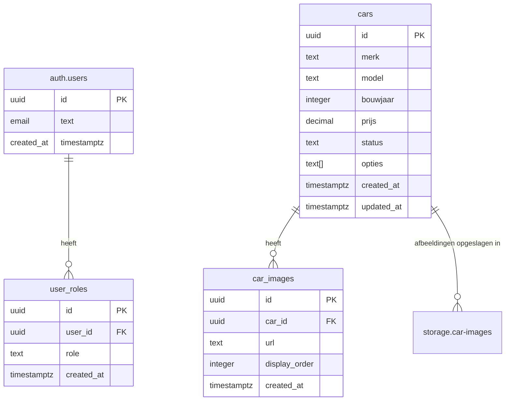

# Kraakman - Database Structure & Schema

## 🗄️ Database Overzicht

**Kraakman** gebruikt PostgreSQL 17.6.1.036 via Supabase (Project ID: `olmfshnswumcehnpclgz`) met Row Level Security (RLS) ingeschakeld voor alle tabellen.

## 📋 Database Tabellen

### 1. `cars` Tabel
**Hoofd voertuig catalogus met volledige specificaties**

```sql
CREATE TYPE car_status AS ENUM ('aanbod', 'verkocht');

CREATE TABLE cars (
  id UUID PRIMARY KEY DEFAULT gen_random_uuid(),
  merk TEXT NOT NULL,                    -- bv. BMW, Volkswagen
  model TEXT NOT NULL,                   -- bv. 3 Series, Golf
  type TEXT,                             -- Car type/trim level
  bouwjaar INTEGER NOT NULL,             -- Productiejaar
  transmissie TEXT,                      -- Handmatig/Automatisch
  kleur TEXT,                           -- Voertuigkleur
  kilometerstand INTEGER,               -- Kilometerstand
  prijs DECIMAL(10,2) NOT NULL,         -- Prijs in EUR
  btw_auto BOOLEAN DEFAULT false,       -- BTW aftrekbaar voertuig
  status car_status NOT NULL DEFAULT 'aanbod',
  voertuig_type TEXT,                   -- Personenwagen, SUV, etc.
  zitplaatsen INTEGER,                  -- Aantal zitplaatsen
  deuren INTEGER,                       -- Aantal deuren
  brandstof_type TEXT,                  -- Benzine, Diesel, Hybrid
  motor_cc INTEGER,                     -- Motorinhoud cc
  motor_cilinders INTEGER,              -- Aantal cilinders
  vermogen_pk INTEGER,                  -- PK vermogen
  gewicht_kg INTEGER,                   -- Gewicht in kg
  topsnelheid_kmh INTEGER,              -- Topsnelheid km/h
  acceleratie_0_100 NUMERIC(3,1),       -- 0-100 km/h tijd
  omschrijving TEXT,                    -- Algemeen beschrijving
  opties TEXT[],                        -- Opties en extras als array
  techniek TEXT,                        -- Technische specificaties (legacy)
  created_at TIMESTAMPTZ DEFAULT NOW(),
  updated_at TIMESTAMPTZ DEFAULT NOW()
);
```

**Key Features:**
- **UUID Primary Key** voor universelewe identificatie
- **Auto-updating timestamps** via trigger
- **ENUM type** voor status consistentie
- **Array support** voor opties (PostgreSQL specificaties)

### 2. `car_images` Tabel
**Voertuig afbeelding URLs en display order**

```sql
CREATE TABLE car_images (
  id UUID PRIMARY KEY DEFAULT gen_random_uuid(),
  car_id UUID NOT NULL REFERENCES cars(id) ON DELETE CASCADE,
  url TEXT NOT NULL,                     -- Image URL
  display_order INTEGER DEFAULT 0,       -- Sorteer volgorde
  created_at TIMESTAMPTZ DEFAULT NOW()
);

-- Index voor performance
CREATE INDEX idx_car_images_car_id ON car_images(car_id);
CREATE INDEX idx_car_images_display_order ON car_images(car_id, display_order);
```

**Key Features:**
- **One-to-Many relatie** met cars table
- **Cascade delete** - automatisch verwijderen bij car verwijdering
- **Display order** voor gesorteerde galerijen
- **Performance indexes** voor snelle queries

### 3. `user_roles` Tabel
**Role-based access control voor geauthenticeerde gebruikers**

```sql
CREATE TYPE app_role AS ENUM ('admin', 'user');

CREATE TABLE user_roles (
  id UUID PRIMARY KEY DEFAULT gen_random_uuid(),
  user_id UUID NOT NULL REFERENCES auth.users(id) ON DELETE CASCADE,
  role app_role NOT NULL DEFAULT 'user',
  created_at TIMESTAMPTZ DEFAULT NOW(),
  UNIQUE(user_id, role)                   -- Geen dubbele rollen per user
);
```

**Key Features:**
- **Externe relatie** met Supabase auth.users
- **ENUM type** voor rollen consistentie
- **Unique constraint** om dubbele rollen te voorkomen

## 🛠️ Database Functies

### `is_admin(user_id UUID) RETURNS BOOLEAN`
**Security definer functie om admin rol te controleren**

```sql
CREATE OR REPLACE FUNCTION is_admin(user_id UUID)
RETURNS BOOLEAN
LANGUAGE plpgsql
SECURITY DEFINER
AS $$
BEGIN
  RETURN EXISTS (
    SELECT 1 FROM user_roles
    WHERE user_id = is_admin.user_id
    AND role = 'admin'
  );
END;
$$;
```

**Kenmerken:**
- **SECURITY DEFINER** - uitgevoerd met database privileges
- **Efficiënt query** - simpele EXISTS check
- **RLS Compatible** - gebruikt door RLS policies

### `update_updated_at_column() RETURNS TRIGGER`
**Automatische timestamp update trigger functie**

```sql
CREATE OR REPLACE FUNCTION update_updated_at_column()
RETURNS TRIGGER
LANGUAGE plpgsql
AS $$
BEGIN
  NEW.updated_at = NOW();
  RETURN NEW;
END;
$$;
```

## 🔧 Triggers

### `update_cars_updated_at`
**Automatisch bijwerken van updated_at timestamp**

```sql
CREATE TRIGGER update_cars_updated_at
BEFORE UPDATE ON public.cars
FOR EACH ROW
EXECUTE FUNCTION update_updated_at_column();
```

## 🔐 Row Level Security (RLS) Policies

### Cars Table Policies

```sql
-- Iedereen mag auto's lezen (publieke toegang)
CREATE POLICY "Public read access to cars" ON public.cars
FOR SELECT USING (true);

-- Alleen admins mogen auto's toevoegen
CREATE POLICY "Admins can insert cars" ON public.cars
FOR INSERT WITH CHECK (
  EXISTS (
    SELECT 1 FROM user_roles
    WHERE user_id = auth.uid()
    AND role = 'admin'
  )
);

-- Alleen admins mogen auto's updaten
CREATE POLICY "Admins can update cars" ON public.cars
FOR UPDATE USING (
  EXISTS (
    SELECT 1 FROM user_roles
    WHERE user_id = auth.uid()
    AND role = 'admin'
  )
);

-- Alleen admins mogen auto's verwijderen
CREATE POLICY "Admins can delete cars" ON public.cars
FOR DELETE USING (
  EXISTS (
    SELECT 1 FROM user_roles
    WHERE user_id = auth.uid()
    AND role = 'admin'
  )
);
```

### Car Images Table Policies

```sql
-- Iedereen mag afbeeldingen lezen
CREATE POLICY "Public read access to car images" ON public.car_images
FOR SELECT USING (true);

-- Admin only policies voor schrijfacties
CREATE POLICY "Admins can insert car images" ON public.car_images
FOR INSERT WITH CHECK (is_admin(auth.uid()));

CREATE POLICY "Admins can update car images" ON public.car_images
FOR UPDATE USING (is_admin(auth.uid()));

CREATE POLICY "Admins can delete car images" ON public.car_images
FOR DELETE USING (is_admin(auth.uid()));
```

### User Roles Table Policies

```sql
-- Alleen admins mogen rollen lezen
CREATE POLICY "Admins can view user roles" ON public.user_roles
FOR SELECT USING (is_admin(auth.uid()));

-- Admin only policies voor modificaties
CREATE POLICY "Admins can insert user roles" ON public.user_roles
FOR INSERT WITH CHECK (is_admin(auth.uid()));

CREATE POLICY "Admins can delete user roles" ON public.user_roles
FOR DELETE USING (is_admin(auth.uid()));
```

## 📁 Supabase Storage Configuratie

### Storage Bucket: `car-images`

```sql
-- Maak bucket aan
INSERT INTO storage.buckets (id, name, public)
VALUES ('car-images', 'car-images', true);

-- Storage Policies
CREATE POLICY "Public read access to car images" ON storage.objects
FOR SELECT USING (
  bucket_id = 'car-images' AND auth.role() = 'anon'
);

CREATE POLICY "Admins can upload car images" ON storage.objects
FOR INSERT WITH CHECK (
  bucket_id = 'car-images' AND is_admin(auth.uid())
);

CREATE POLICY "Admins can update car images" ON storage.objects
FOR UPDATE USING (
  bucket_id = 'car-images' AND is_admin(auth.uid())
);

CREATE POLICY "Admins can delete car images" ON storage.objects
FOR DELETE USING (
  bucket_id = 'car-images' AND is_admin(auth.uid())
);
```

## 🔗 Database Relaties



## 📊 Data Types & Constraints

### ENUMs
```sql
-- Voertuig statussen
CREATE TYPE car_status AS ENUM ('aanbod', 'verkocht');

-- Gebruikersrollen
CREATE TYPE app_role AS ENUM ('admin', 'user');
```

### Belangrijke Constraints
- **Foreign Keys**: Referentiële integriteit tussen tabellen
- **NOT NULL**: Verplichte velden voor data kwaliteit
- **CHECK Constraints**: Business rule validatie (indien nodig)
- **UNIQUE**: Voorkomt duplicaten (user_id, role combinatie)

## 🚀 Performance Optimalisaties

### Indexes
```sql
-- Cars table indexes
CREATE INDEX idx_cars_status ON cars(status);
CREATE INDEX idx_cars_merk_model ON cars(merk, model);
CREATE INDEX idx_cars_prijs ON cars(prijs);
CREATE INDEX idx_cars_created_at ON cars(created_at DESC);

-- Car images indexes
CREATE INDEX idx_car_images_car_id ON car_images(car_id);
CREATE INDEX idx_car_images_display_order ON car_images(car_id, display_order);

-- User roles indexes
CREATE INDEX idx_user_roles_user_id ON user_roles(user_id);
CREATE INDEX idx_user_roles_role ON user_roles(role);
```

### Query Optimalisaties
- **Efficiënt filtering** op gescoorde kolommen
- **JSON/Array operators** voor opties zoekfunctionaliteit
- **Pagination** voor grote datasets
- **Caching** via Supabase edge caching

## 🔒 Security Model

1. **Authentication**: Supabase Auth systeem
2. **Authorization**: `is_admin()` functie voor permission checks
3. **Data Protection**: RLS policies op alle tabellen
4. **Storage Security**: Bucket-level policies
5. **Session Management**: JWT tokens met verloop

## 📝 Gebruikspatronen

### Auto Toevoegen
```sql
INSERT INTO cars (
  merk, model, bouwjaar, prijs, status, opties
) VALUES (
  'BMW', '3 Series', 2022, 45000.00, 'aanbod',
  ARRAY['Navi', 'Cruise Control', 'Leder interieur']
);
```

### Afbeeldingen Toevoegen
```sql
INSERT INTO car_images (car_id, url, display_order)
VALUES (
  'car-uuid-here',
  'https://storage-url/image.jpg',
  1
);
```

### Admin Rol Toewijzen
```sql
INSERT INTO user_roles (user_id, role)
VALUES ('auth-user-uuid', 'admin');
```

---

Deze database structuur biedt een veilige, schaalbare basis voor het automotive dealership platform met proper data bescherming via RLS policies en uitgebreide functionaliteit voor voertuigbeheer.