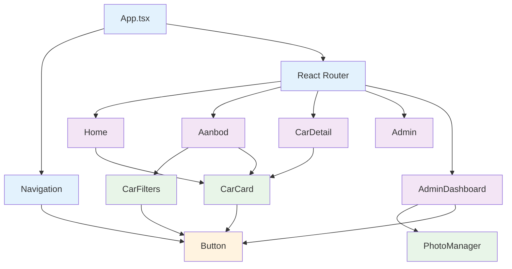

# Kraakman - Development Guide

## 👨‍💻 Development Setup

**Kraakman** is een modern React + TypeScript project met Supabase backend. Deze gids helpt ontwikkelaars snel aan de slag te gaan met een complete development environment.

## 📋 Vereisten

### Systeem Vereisten
- **Node.js**: 18.x of hoger
- **npm**: 9.x of hoger
- **Git**: 2.40+ (voor hooks en features)

### IDE Aanbevelingen
- **VS Code**: Met volgende extensions:
  - TypeScript Importer
  - ES7+ React/Redux/React-Native snippets
  - Tailwind CSS IntelliSense
  - Prettier - Code formatter
  - ESLint

## 🚀 Quick Start

### 1. Project Clone

```bash
git clone https://github.com/your-org/kraakman.git
cd kraakman
```

### 2. Dependencies Installeren

```bash
npm install
```

### 3. Environment Setup

```bash
# Kopieer environment template
cp .env.example .env.local

# Vul je Supabase credentials in
code .env.local
```

### 4. Development Server Starten

```bash
npm run dev
```

Bezoek `http://localhost:8080` om de app te bekijken!

## 📂 Project Structuur Uitleg

### Kern Mappen

```
kraakman/
├── src/                     # Alle broncode
│   ├── components/          # Herbruikbare UI componenten
│   │   ├── ui/             # Shadcn/ui basis componenten
│   │   ├── CarCard.tsx    # Auto display component
│   │   ├── CarFilters.tsx # Filter interface
│   │   ├── Navigation.tsx # Site navigatie
│   │   ├── PhotoManager.tsx # Afbeelding beheer
│   │   └── Footer.tsx     # Site footer
│   ├── pages/             # App pagina's
│   │   ├── Home.tsx        # Home pagina
│   │   ├── Aanbod.tsx      # Beschikbare auto's
│   │   ├── CarDetail.tsx   # Auto detail pagina
│   │   ├── Verkocht.tsx    # Verkochte auto's
│   │   ├── Admin.tsx       # Admin login
│   │   └── AdminDashboard.tsx # Admin beheer
│   ├── services/          # Business logic
│   │   └── carService.ts  # Auto data operaties
│   ├── hooks/             # Custom React hooks
│   │   ├── useAuth.ts
│   │   ├── useCars.ts
│   │   ├── useAdminAuth.ts
│   │   └── useToast.ts
│   ├── integrations/       # Externe services
│   │   └── supabase/      # Supabase client
│   │       ├── client.ts  # Supabase setup
│   │       └── types.ts   # Auto-generated types
│   ├── styles/            # CSS en design system
│   │   ├── colors.css     # Kleur system
│   │   ├── spacing.css    # Spacing system
│   │   └── components.css # Component styling
│   ├── types/             # TypeScript definities
│   │   └── index.ts       # Global types
│   ├── lib/               # Utility functions
│   │   └── utils.ts       # Helper functies
│   └── main.tsx           # App entry point
├── supabase/              # Database migraties
├── public/               # Static assets
└── dist/                 # Build output
```

### Component Hierarchy



## 🎨 Component Ontwikkeling

### Component Sjabloon

```typescript
// src/components/ExampleComponent.tsx
import { useState } from 'react'
import { Button } from '@/components/ui/button'
import { Card, CardContent, CardHeader, CardTitle } from '@/components/ui/card'

interface ExampleComponentProps {
  title: string
  description: string
  onAction?: () => void
}

const ExampleComponent: React.FC<ExampleComponentProps> = ({
  title,
  description,
  onAction,
}) => {
  const [isLoading, setIsLoading] = useState(false)

  const handleClick = async () => {
    setIsLoading(true)
    try {
      await onAction?.()
    } catch (error) {
      console.error('Action failed:', error)
    } finally {
      setIsLoading(false)
    }
  }

  return (
    <Card className="w-full max-w-md">
      <CardHeader>
        <CardTitle>{title}</CardTitle>
      </CardHeader>
      <CardContent>
        <p className="text-muted-foreground mb-4">{description}</p>
        <Button
          onClick={handleClick}
          disabled={isLoading}
          className="w-full"
        >
          {isLoading ? 'Loading...' : 'Actie'}
        </Button>
      </CardContent>
    </Card>
  )
}

export default ExampleComponent
```

### Best Practices

1. **Type Safety**: Gebruik TypeScript interfaces voor props
2. **Accessibility**: Voeg proper ARIA labels toe
3. **Responsive**: Mobile-first design met Tailwind
4. **Error Handling**: Gebruik error boundaries
5. **Performance**: Gebruik React.memo voor dure componenten

## 🔄 State Management

### Lokale State

```typescript
// useState voor lokale component state
const [isOpen, setIsOpen] = useState(false)
const [formData, setFormData] = useState({
  merk: '',
  model: '',
  bouwjaar: new Date().getFullYear(),
})
```

### Server State met TanStack Query

```typescript
// src/hooks/useCars.ts
import { useQuery, useMutation, useQueryClient } from '@tanstack/react-query'
import { getCars } from '@/services/carService'

export const useCars = (filters = {}) => {
  return useQuery({
    queryKey: ['cars', filters],
    queryFn: () => getCars(filters),
    staleTime: 5 * 60 * 1000, // 5 minutes
    cacheTime: 10 * 60 * 1000, // 10 minutes
  })
}
```

### Global State

```typescript
// src/context/ThemeContext.tsx
import { createContext, useContext, useState, ReactNode } from 'react'

interface ThemeContextType {
  isDark: boolean
  toggleTheme: () => void
}

const ThemeContext = createContext<ThemeContextType | undefined>(undefined)

export const ThemeProvider: React.FC<{ children: ReactNode }> = ({ children }) => {
  const [isDark, setIsDark] = useState(false)

  const toggleTheme = () => {
    setIsDark(!isDark)
  }

  return (
    <ThemeContext.Provider value={{ isDark, toggleTheme }}>
      {children}
    </ThemeContext.Provider>
  )
}

export const useTheme = () => {
  const context = useContext(ThemeContext)
  if (context === undefined) {
    throw new Error('useTheme must be used within a ThemeProvider')
  }
  return context
}
```

## 🛠️ Development Tools

### ESLint Configuratie

```json
// .eslintrc.json
{
  "extends": [
    "eslint:recommended",
    "@typescript-eslint/recommended",
    "plugin:react/recommended",
    "plugin:react-hooks/recommended"
  ],
  "parser": "@typescript-eslint/parser",
  "plugins": ["@typescript-eslint", "react", "react-hooks"],
  "rules": {
    "react-hooks/rules-of-hooks": "error",
    "react-hooks/exhaustive-deps": "warn",
    "@typescript-eslint/no-unused-vars": "error",
    "prefer-const": "error"
  },
  "settings": {
    "react": {
      "version": "detect"
    }
  }
}
```

### Prettier Configuratie

```json
// .prettierrc
{
  "semi": false,
  "trailingComma": true,
  "tabWidth": 2,
  "singleQuote": true,
  "printWidth": 80,
  "bracketSpacing": true,
  "arrowParens": "avoid"
}
```

### TypeScript Configuratie

```json
// tsconfig.json
{
  "compilerOptions": {
    "target": "ES2020",
    "useDefineForClassFields": true,
    "lib": ["DOM", "DOM.Iterable"],
    "module": "ESNext",
    "skipLibCheck": true,
    "moduleResolution": "bundler",
    "allowImportingTsExtensions": true,
    "resolveJsonModule": true,
    "isolatedModules": true,
    "noEmit": true,
    "jsx": "react-jsx",
    "strict": true,
    "noUnusedLocals": true,
    "noUnusedParameters": true,
    "noFallthroughCasesInSwitch": true,
    "baseUrl": ".",
    "paths": {
      "@/*": ["./src/*"]
    }
  },
  "include": ["src"],
  "references": [{ "path": "./tsconfig.node.json" }]
}
```

## 🧪 Testing

### Unit Testing met Vitest

```typescript
// src/components/__tests__/CarCard.test.tsx
import { render, screen, fireEvent, waitFor } from '@testing-library/react'
import { describe, it, expect } from 'vitest'
import { CarCard } from '../CarCard'

const mockCar = {
  id: 'test-1',
  merk: 'BMW',
  model: '3 Series',
  bouwjaar: 2022,
  prijs: 45000,
  status: 'aanbod',
  car_images: [
    { url: 'image1.jpg', display_order: 0 },
    { url: 'image2.jpg', display_order: 1 },
  ],
}

describe('CarCard', () => {
  it('renders car information correctly', () => {
    render(<CarCard {...mockCar} />)

    expect(screen.getByText('BMW 3 Series')).toBeInTheDocument()
    expect(screen.getByText('2022')).toBeInTheDocument()
    expect(screen.getByText('€ 45.000')).toBeInTheDocument()
  })

  it('shows navigation buttons when multiple images', () => {
    render(<CarCard {...mockCar} />)

    expect(screen.getByLabelText('Vorige foto')).toBeInTheDocument()
    expect(screen.getByLabelText('Volgende foto')).toBeInTheDocument()
  })

  it('handles image navigation', async () => {
    render(<CarCard {...mockCar} />)

    const nextButton = screen.getByLabelText('Volgende foto')

    fireEvent.click(nextButton)

    await waitFor(() => {
      // Verify second image is shown
      const images = screen.getAllByRole('img')
      expect(images).toHaveLength(2)
    })
  })
})
```

### Integration Testing

```typescript
// src/__tests__/App.test.tsx
import { render, screen } from '@testing-library/react'
import { BrowserRouter } from 'react-router-dom'
import App from '../App'
import { QueryClient, QueryClientProvider } from '@tanstack/react-query'

const createTestQueryClient = () =>
  new QueryClient({
    defaultOptions: {
      queries: { retry: false },
      mutations: { retry: false },
    },
  })

describe('App Integration', () => {
  it('renders home page by default', () => {
    const queryClient = createTestQueryClient()

    render(
      <QueryClientProvider client={queryClient}>
        <BrowserRouter>
          <App />
        </BrowserRouter>
      </QueryClientProvider>
    )

    expect(screen.getByText(/kraakman/i)).toBeInTheDocument()
  })

  it('navigates to aanbod page', async () => {
    const queryClient = createTestQueryClient()

    render(
      <QueryClientProvider client={queryClient}>
        <BrowserRouter>
          <App />
        </BrowserRouter>
      </QueryClientProvider>
    )

    const aanbodLink = screen.getByText(/aanbod/i)
    fireEvent.click(aanbodLink)

    await waitFor(() => {
      expect(screen.getByText(/beschikbare auto's/i)).toBeInTheDocument()
    })
  })
})
```

## 🐛 Supabase Development

### Lokale Supabase Setup

```bash
# Install Supabase CLI
npm install -g supabase

# Login naar je project
supabase login

# Link lokaal project
supabase link --project-reference olmfshnswumcehnpclgz

# Start lokale database
supabase start
```

### Database Migraties

```bash
# Maak nieuwe migratie
supabase migration new add_motor_specificaties

# Apply migraties
supabase db push

# Genereer types
supabase gen types typescript --local
```

### Seed Data

```sql
-- supabase/seed.sql
-- Insert sample data for development

INSERT INTO cars (merk, model, bouwjaar, prijs, status, opties) VALUES
('BMW', '3 Series', 2022, 45000.00, 'aanbod', ARRAY['Navi', 'Cruise Control', 'Leder interieur']),
('Volkswagen', 'Golf', 2021, 35000.00, 'aanbod', ARRAY['Bluetooth', 'Climate Control', 'Park Distance']),
('Mercedes', 'C-Klasse', 2023, 65000.00, 'aanbod', ARRAY['AMG Line', 'Burmester Audio', 'Adaptive Cruise']);
```

## 🚀 Performance Optimalisatie

### React Performance

```typescript
// Gebruik React.memo voor dure componenten
const ExpensiveComponent = React.memo(({ data }) => {
  // Expensieve berekening
  const processedData = useMemo(() => {
    return data.map(item => expensiveProcessing(item))
  }, [data])

  return <div>{processedData}</div>
})

// Gebruik useCallback voor functies
const ComponentWithCallbacks = () => {
  const [value, setValue] = useState(0)

  const handleClick = useCallback(() => {
    setValue(v => v + 1)
  }, [])

  return <button onClick={handleClick}>Count: {value}</button>
}
```

### Bundle Optimalisatie

```typescript
// vite.config.ts
export default defineConfig({
  build: {
    rollupOptions: {
      output: {
        manualChunks: {
          vendor: ['react', 'react-dom'],
          router: ['react-router-dom'],
          ui: ['@radix-ui/react-dialog', '@radix-ui/react-select'],
        },
      },
    },
  },
})
```

## 🐛 Debugging

### Chrome DevTools

```typescript
// Debug logging component
const DebugInfo: React.FC = ({ children }) => {
  if (process.env.NODE_ENV !== 'development') {
    return null
  }

  return (
    <div className="fixed bottom-4 right-4 bg-black text-white p-2 rounded text-xs">
      <pre>{JSON.stringify(children, null, 2)}</pre>
    </div>
  )
}

// Gebruik in component
const CarDetail = ({ carId }: { carId: string }) => {
  const { data: car, error, isLoading } = useCar(carId)

  if (process.env.NODE_ENV === 'development') {
    console.log('Car data:', car)
    console.log('Loading state:', isLoading)
  }

  return (
    <>
      <DebugInfo car={car} isLoading={isLoading} error={error} />
      {/* Component content */}
    </>
  )
}
```

### React DevTools Profiler

```typescript
// src/App.tsx
import { Profiler } from 'react'

function App() {
  return (
    <Profiler id="App" label="App component">
      {/* App content */}
    </Profiler>
  )
}
```

## 📝 Code Conventies

### TypeScript Conventies

```typescript
// Interfaces
interface Car {
  id: string
  merk: string
  model: string
  bouwjaar: number
  prijs: number
}

// Props interfaces
interface CarCardProps {
  car: Car
  onSelect?: (car: Car) => void
  variant?: 'default' | 'compact'
}

// Component signatures
const CarCard: React.FC<CarCardProps> = ({ car, onSelect, variant = 'default' }) => {
  // Component implementation
}
```

### CSS/Class Conventies

```typescript
// CSS Modules (optioneel)
import styles from './Component.module.css'

// Tailwind classes
const Button = ({ variant, size, children, ...props }) => (
  <button
    className={cn(
      'px-4 py-2 rounded-md font-medium',
      variant === 'primary' && 'bg-blue-500 text-white',
      variant === 'secondary' && 'bg-gray-200 text-gray-800',
      size === 'sm' && 'px-3 py-1 text-sm',
      size === 'lg' && 'px-6 py-3 text-lg',
      className
    )}
    {...props}
  >
    {children}
  </button>
)
```

## 🔧 Troubleshooting

### Veelvoorkende Problemen

1. **Build errors**: Check TypeScript compilation
   ```bash
   npm run type-check
   ```

2. **Import errors**: Check path aliases in tsconfig.json
   ```bash
   # Zorg dat pad alias correct is ingesteld
   import { Button } from '@/components/ui/button'
   ```

3. **Styling issues**: Check Tailwind configuration
   ```bash
   # Verifieer dat Tailwind CSS correct is ingesteld
   npm list tailwindcss
   ```

4. **Supabase verbinding**: Check environment variables
   ```bash
   # Controleer .env.local bestaat
   cat .env.local
   ```

### Log Patronen

```typescript
// Log levels
console.log('Info:', data)           // Informatie
console.warn('Warning:', message)     // Waarschuwing
console.error('Error:', error)       // Fout

// Structured logging
console.log('Car created:', {
  id: car.id,
  merk: car.merk,
  model: car.model,
  timestamp: new Date().toISOString(),
})
```

---

Deze development gids helpt je snel aan de slag te gaan met de Kraakman codebase en volgt de best practices voor moderne React development.