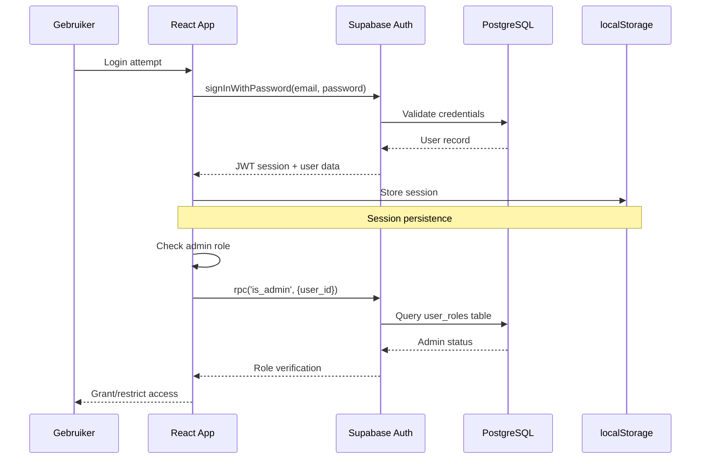
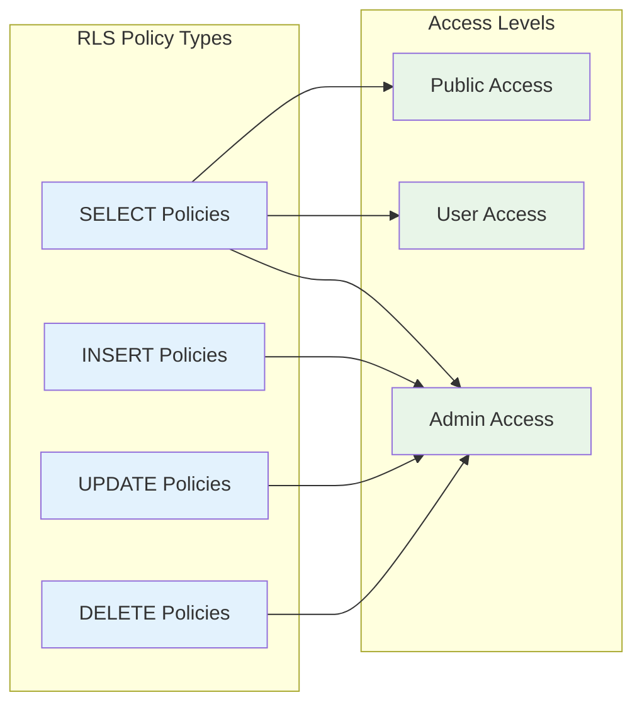

# Kraakman - Security & Authenticatie

## 🔐 Security Overzicht

**Kraakman** implementeert een multi-layer security model met Supabase Auth, Row Level Security (RLS), en role-based access control. Het systeem is ontworpen voor maximale data bescherming met een gebruiksvriendelijke admin interface.

## 🏗️ Security Architecture

```mermaid
graph TD
    subgraph "Client Layer"
        USER[Gebruiker]
        BROWSER[Browser]
        REACT[React App]
        STORAGE[localStorage]
    end

    subgraph "Authentication Layer"
        SUPABASE_AUTH[Supabase Auth]
        JWT[JWT Tokens]
        SESSION[Session Management]
    end

    subgraph "Authorization Layer"
        RLS[Row Level Security]
        ROLES[User Roles Table]
        ADMIN_FUNC[is_admin() Function]
    end

    subgraph "Data Layer"
        POSTGRES[(PostgreSQL DB)]
        SUPABASE_STORAGE[Supabase Storage]
    end

    USER --> BROWSER
    BROWSER --> REACT
    REACT --> SUPABASE_AUTH
    SUPABASE_AUTH --> JWT
    REACT --> STORAGE

    REACT --> RLS
    RLS --> ADMIN_FUNC
    ADMIN_FUNC --> ROLES
    RLS --> POSTGRES
    REACT --> SUPABASE_STORAGE

    classDef client fill:#e3f2fd
    classDef auth fill:#f3e5f5
    classDef authz fill:#e8f5e8
    classDef data fill:#fff3e0

    class USER,BROWSER,REACT,STORAGE client
    class SUPABASE_AUTH,JWT,SESSION auth
    class RLS,ROLES,ADMIN_FUNC authz
    class POSTGRES,SUPABASE_STORAGE data
```

## 🛡️ Authentication System

### Supabase Auth Configuratie

```typescript
// src/integrations/supabase/client.ts
import { createClient } from '@supabase/supabase-js'

const supabaseUrl = process.env.REACT_APP_SUPABASE_URL!
const supabaseAnonKey = process.env.REACT_APP_SUPABASE_ANON_KEY!

export const supabase = createClient(supabaseUrl, supabaseAnonKey, {
  auth: {
    autoRefreshToken: true,
    persistSession: true,
    detectSessionInUrl: true,
    storage: window.localStorage,
    storageKey: 'kraakman-auth-token',
  },
})
```

### Authentication Flow



### Login Implementation

```typescript
// src/pages/Admin.tsx
const handleLogin = async (e: React.FormEvent) => {
  e.preventDefault();
  setLoading(true);

  // 1. Authenticate user
  const { data, error } = await supabase.auth.signInWithPassword({
    email,
    password,
  });

  if (error) {
    toast({
      title: "Fout bij inloggen",
      description: error.message,
      variant: "destructive",
    });
    setLoading(false);
    return;
  }

  // 2. Verify admin role
  if (data.user) {
    const { data: isAdminData, error: adminError } = await supabase.rpc('is_admin', {
      user_id: data.user.id
    });

    if (adminError || !isAdminData) {
      await supabase.auth.signOut();
      toast({
        title: "Toegang geweigerd",
        description: "Je hebt geen admin rechten.",
        variant: "destructive",
      });
      setLoading(false);
      return;
    }

    // 3. Success - navigate to dashboard
    toast({
      title: "Ingelogd",
      description: "Je wordt doorgestuurd naar het dashboard.",
    });
    navigate("/admin/dashboard");
  }

  setLoading(false);
};
```

### Session Management

```typescript
// src/hooks/useAuth.ts
import { useEffect, useState } from 'react'
import { supabase } from '@/integrations/supabase/client'
import { User } from '@supabase/supabase-js'

export const useAuth = () => {
  const [user, setUser] = useState<User | null>(null)
  const [loading, setLoading] = useState(true)

  useEffect(() => {
    // Get initial session
    const getSession = async () => {
      const { data: { session } } = await supabase.auth.getSession()
      setUser(session?.user ?? null)
      setLoading(false)
    }

    getSession()

    // Listen for auth changes
    const { data: { subscription } } = supabase.auth.onAuthStateChange(
      async (_event, session) => {
        setUser(session?.user ?? null)
        setLoading(false)
      }
    )

    return () => subscription.unsubscribe()
  }, [])

  const signOut = async () => {
    await supabase.auth.signOut()
  }

  return {
    user,
    loading,
    signOut,
  }
}
```

## 🔑 Role-Based Access Control (RBAC)

### User Roles Table

```sql
-- src/integrations/supabase/types.ts (auto-generated)
export interface Database {
  public: {
    Tables: {
      user_roles: {
        Row: {
          id: string
          user_id: string
          role: 'admin' | 'user'
          created_at: string
        }
        Insert: {
          id?: string
          user_id: string
          role: 'admin' | 'user'
          created_at?: string
        }
        Update: {
          id?: string
          user_id?: string
          role?: 'admin' | 'user'
          created_at?: string
        }
      }
    }
  }
}
```

### Admin Verification Function

```sql
-- Database function for admin check
CREATE OR REPLACE FUNCTION is_admin(user_id UUID)
RETURNS BOOLEAN
LANGUAGE plpgsql
SECURITY DEFINER
AS $$
BEGIN
  RETURN EXISTS (
    SELECT 1 FROM user_roles
    WHERE user_id = is_admin.user_id
    AND role = 'admin'
  );
END;
$$;
```

### Type-safe Admin Check

```typescript
// src/hooks/useAdminAuth.ts
import { useAuth } from './useAuth'
import { supabase } from '@/integrations/supabase/client'

export const useAdminAuth = () => {
  const { user, loading: authLoading } = useAuth()
  const [isAdmin, setIsAdmin] = useState(false)
  const [loading, setLoading] = useState(true)

  useEffect(() => {
    const checkAdminRole = async () => {
      if (!user) {
        setIsAdmin(false)
        setLoading(false)
        return
      }

      try {
        const { data, error } = await supabase.rpc('is_admin', {
          user_id: user.id
        })

        if (error) {
          console.error('Admin check error:', error)
          setIsAdmin(false)
        } else {
          setIsAdmin(!!data)
        }
      } catch (error) {
        console.error('Admin check error:', error)
        setIsAdmin(false)
      } finally {
        setLoading(false)
      }
    }

    checkAdminRole()
  }, [user])

  return {
    isAdmin,
    loading: loading || authLoading,
    user,
  }
}
```

## 🔒 Row Level Security (RLS)

### Security Policies Overview



### Cars Table RLS Policies

```sql
-- Enable RLS on cars table
ALTER TABLE cars ENABLE ROW LEVEL SECURITY;

-- 1. Public read access (everyone can view cars)
CREATE POLICY "Public read access to cars" ON public.cars
FOR SELECT USING (true);

-- 2. Admin only - insert cars
CREATE POLICY "Admins can insert cars" ON public.cars
FOR INSERT WITH CHECK (
  is_admin(auth.uid())
);

-- 3. Admin only - update cars
CREATE POLICY "Admins can update cars" ON public.cars
FOR UPDATE USING (
  is_admin(auth.uid())
);

-- 4. Admin only - delete cars
CREATE POLICY "Admins can delete cars" ON public.cars
FOR DELETE USING (
  is_admin(auth.uid())
);
```

### Car Images Table RLS Policies

```sql
-- Enable RLS on car_images table
ALTER TABLE car_images ENABLE ROW LEVEL SECURITY;

-- Public read access
CREATE POLICY "Public read access to car images" ON public.car_images
FOR SELECT USING (true);

-- Admin only operations
CREATE POLICY "Admins can manage car images" ON public.car_images
FOR ALL USING (
  is_admin(auth.uid())
) WITH CHECK (
  is_admin(auth.uid())
);
```

### User Roles Table RLS Policies

```sql
-- Enable RLS on user_roles table
ALTER TABLE user_roles ENABLE ROW LEVEL SECURITY;

-- Only admins can manage user roles
CREATE POLICY "Admins can manage user roles" ON public.user_roles
FOR ALL USING (
  is_admin(auth.uid())
);
```

## 📁 Supabase Storage Security

### Storage Buckets

```sql
-- Create car-images bucket
INSERT INTO storage.buckets (id, name, public)
VALUES ('car-images', 'car-images', true);

-- Enable RLS on storage
ALTER TABLE storage.objects ENABLE ROW LEVEL SECURITY;
```

### Storage Policies

```sql
-- Public read access to car images
CREATE POLICY "Public read access to car images" ON storage.objects
FOR SELECT USING (
  bucket_id = 'car-images' AND
  auth.role() = 'anon'
);

-- Admin only write access
CREATE POLICY "Admins can manage car images" ON storage.objects
FOR ALL USING (
  bucket_id = 'car-images' AND
  is_admin(auth.uid())
);
```

### File Upload Implementation

```typescript
// src/components/PhotoManager.tsx
const handleImageUpload = async (files: FileList) => {
  if (!carId) return;

  const uploadPromises = Array.from(files).map(async (file, index) => {
    const fileExt = file.name.split('.').pop()
    const fileName = `${carId}/${Date.now()}-${index}.${fileExt}`
    const filePath = `${fileName}`

    // 1. Upload to Supabase Storage
    const { error: uploadError } = await supabase.storage
      .from('car-images')
      .upload(filePath, file)

    if (uploadError) {
      throw uploadError
    }

    // 2. Get public URL
    const { data: { publicUrl } } = supabase.storage
      .from('car-images')
      .getPublicUrl(filePath)

    // 3. Insert metadata in database
    const { error: dbError } = await supabase
      .from('car_images')
      .insert({
        car_id: carId,
        url: publicUrl,
        display_order: currentImages.length + index,
      })

    if (dbError) {
      throw dbError
    }

    return { url: publicUrl, display_order: currentImages.length + index }
  })

  try {
    const newImages = await Promise.all(uploadPromises)
    onImagesChange([...currentImages, ...newImages])
  } catch (error) {
    toast({
      title: "Upload fout",
      description: "Er is een fout opgetreden bij het uploaden van afbeeldingen.",
      variant: "destructive",
    })
  }
}
```

## 🚪 Route Protection

### Protected Route Component

```typescript
// src/components/ProtectedRoute.tsx
import { useNavigate } from 'react-router-dom'
import { useEffect } from 'react'
import { useAdminAuth } from '@/hooks/useAdminAuth'

interface ProtectedRouteProps {
  children: React.ReactNode
}

const ProtectedRoute = ({ children }: ProtectedRouteProps) => {
  const navigate = useNavigate()
  const { isAdmin, loading } = useAdminAuth()

  useEffect(() => {
    if (!loading && !isAdmin) {
      navigate('/admin')
    }
  }, [isAdmin, loading, navigate])

  if (loading) {
    return <div>Laden...</div>
  }

  return isAdmin ? <>{children}</> : null
}

export default ProtectedRoute
```

### Route Configuration

```typescript
// src/App.tsx
import { BrowserRouter as Router, Routes, Route } from 'react-router-dom'
import ProtectedRoute from '@/components/ProtectedRoute'

function App() {
  return (
    <Router>
      <Routes>
        {/* Public routes */}
        <Route path="/" element={<Home />} />
        <Route path="/aanbod" element={<Aanbod />} />
        <Route path="/verkocht" element={<Verkocht />} />
        <Route path="/admin" element={<Admin />} />

        {/* Protected admin routes */}
        <Route
          path="/admin/dashboard"
          element={
            <ProtectedRoute>
              <AdminDashboard />
            </ProtectedRoute>
          }
        />
      </Routes>
    </Router>
  )
}
```

## 🔍 Security Best Practices

### 1. **Environment Variables**

```typescript
// .env.example
REACT_APP_SUPABASE_URL=https://your-project.supabase.co
REACT_APP_SUPABASE_ANON_KEY=your-anon-key

# Never expose service_role key in frontend!
```

### 2. **Input Validation**

```typescript
// Sanitize user inputs
const sanitizeCarData = (carData: Partial<Car>) => {
  return {
    ...carData,
    merk: carData.merk?.trim().replace(/[<>]/g, ''),
    model: carData.model?.trim().replace(/[<>]/g, ''),
    prijs: Math.max(0, Number(carData.prijs) || 0),
    bouwjaar: Math.max(1900, Math.min(2030, Number(carData.bouwjaar) || new Date().getFullYear())),
  }
}
```

### 3. **Error Handling**

```typescript
// Generic error handling
const handleSupabaseError = (error: any) => {
  console.error('Supabase error:', error)

  if (error.code === 'PGRST116') {
    return { message: 'Record niet gevonden', type: 'not_found' }
  }

  if (error.code === '42501') {
    return { message: 'Geen toegang', type: 'permission_denied' }
  }

  return { message: 'Er is een fout opgetreden', type: 'unknown' }
}
```

### 4. **Session Security**

```typescript
// Session timeout management
const useSessionTimeout = () => {
  const [lastActivity, setLastActivity] = useState(Date.now())

  useEffect(() => {
    const interval = setInterval(() => {
      const now = Date.now()
      const inactiveTime = now - lastActivity

      // Auto logout after 2 hours of inactivity
      if (inactiveTime > 2 * 60 * 60 * 1000) {
        supabase.auth.signOut()
      }
    }, 60000) // Check every minute

    return () => clearInterval(interval)
  }, [lastActivity])

  const updateActivity = () => setLastActivity(Date.now())

  return { updateActivity }
}
```

## 🔐 Security Headers & CSP

### Vercel Configuration

```json
// vercel.json
{
  "headers": [
    {
      "source": "/(.*)",
      "headers": [
        {
          "key": "X-Content-Type-Options",
          "value": "nosniff"
        },
        {
          "key": "X-Frame-Options",
          "value": "DENY"
        },
        {
          "key": "X-XSS-Protection",
          "value": "1; mode=block"
        },
        {
          "key": "Strict-Transport-Security",
          "value": "max-age=31536000; includeSubDomains"
        }
      ]
    }
  ]
}
```

### Content Security Policy

```javascript
// index.html head
<meta http-equiv="Content-Security-Policy" content="
  default-src 'self';
  script-src 'self' 'unsafe-inline' 'unsafe-eval' https://cdn.jsdelivr.net;
  style-src 'self' 'unsafe-inline' https://fonts.googleapis.com;
  font-src 'self' https://fonts.gstatic.com;
  img-src 'self' data: https://*.supabase.co;
  connect-src 'self' https://*.supabase.co;
">
```

## 📊 Security Monitoring

### Audit Logging

```typescript
// src/utils/securityLogger.ts
const logSecurityEvent = (event: string, details: any) => {
  const logEntry = {
    timestamp: new Date().toISOString(),
    event,
    details,
    userAgent: navigator.userAgent,
    ip: 'client-ip', // Would need backend implementation
  }

  console.log('Security Event:', logEntry)

  // In production, send to monitoring service
  if (process.env.NODE_ENV === 'production') {
    // Send to logging service
  }
}

// Usage examples
logSecurityEvent('ADMIN_LOGIN', { userId: user.id, success: true })
logSecurityEvent('CAR_CREATE', { userId: user.id, carId: newCar.id })
logSecurityEvent('PERMISSION_DENIED', { userId: user.id, attempted: 'car_delete' })
```

## 🔄 Security Checklist

### ✅ **Implemented**
- [x] Supabase Auth integration
- [x] Row Level Security policies
- [x] Role-based access control
- [x] Route protection
- [x] Input sanitization
- [x] Error handling
- [x] Session management
- [x] Storage security

### ⚠️ **Considerations**
- [ ] Rate limiting on login attempts
- [ ] IP blocking for repeated failures
- [ ] Audit trail for admin actions
- [ ] Session timeout configuration
- [ ] CORS policy refinement
- [ ] Subresource integrity (SRI)

### 🚀 **Best Practices**
- [x] Use environment variables for secrets
- [x] Implement proper error boundaries
- [x] Validate all user inputs
- [x] Use HTTPS in production
- [x] Regular security audits
- [x] Keep dependencies updated

---

De security architectuur van Kraakman is gebouwd met defense-in-depth principes, waarbij elke laag aparte beveiliging biedt tegen verschillende types bedreigingen. Het systeem balanceert tussen robuuste security en gebruiksgemak voor administrators.